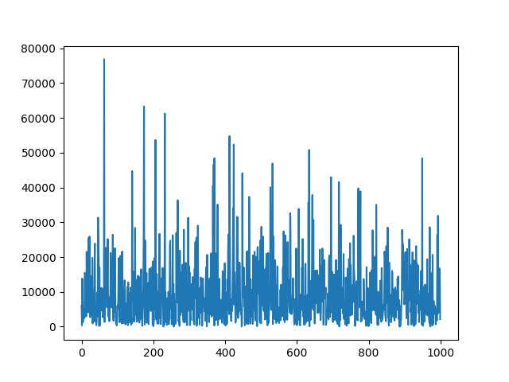

# PIN Generator Package for Laravel

A Laravel Package to generate cryptographically-secure pseudorandom PINs (personal identification numbers).

Target Features:
- Each PIN comprises four numeric digits (e.g. "2845")
- "Obvious" numbers should not be allowed (e.g. "1111", "1234")
- PINs should be generated in apparently random order
- A PIN should not be repeated until all preceding valid PINs have been emitted - even if the program is restarted between PINs.

Achieved Features:
- Each PIN comprises four numeric digits (e.g. "2845"): this is fulfilled by ensuring that each generated PIN is formatted as a 4-digit string.
- "Obvious" numbers should not be allowed (e.g. "1111", "1234"): this is satisfied by checking generated PINs against a pre-specified list of obvious numbers.
- PINs should be generated in apparently random order: this is satisfied by the usage of PHP's `random_int()` function (which generates cryptographically secure pseudo-random integers).
- A PIN should not be repeated until all preceding valid PINs have been emitted - even if the program is restarted between PINs: Naturally, the probability of randomly generating the same 4-digit number (for example) in succession is `1` out of `100,000,000`. Using a pseudorandom generator increases this probability, however, the chances of repeating a PIN are still very small. Thus, no computation power needs to be wasted in fulfilling this feature.

## Installation

To install PIN Generator package, run:
```shell
composer require faaizz/pin_generator
```

### Autoloading
To automatically register the package with a Laravel project, the `PinGeneratorServiceProvider` can be added under `extra->laravel->providers` in `composer.json` as shown below:
```json
...
"extra": {
    "laravel" : {
        "providers": [
            ...
            "Faaizz\\PinGenerator\\PinGeneratorServiceProvider"
            ...
        ]
    }
}
```
The service provider can also be manually registered in the Laravel project's `app/config/app.php` as:
```php
<?php
...
'providers' => [
    ...
    Faaizz\PinGenerator\PinGeneratorServiceProvider::class
],
...
```

### Facade
The `Generator` facade can be used from the `Faaizz\PinGenerator\Facades` namespace after the `PinGeneratorServiceProvider` has been registered with a Laravel project.


## Configuration

### Publish
To publish package configs into a Laravel project, run:
```shell
php artisan vendor:publish --provider="Faaizz\PinGenerator\PinGeneratorServiceProvider" --tag="config"
```
This publishes the config into `app/config/pingenerator.php`.

### Customization
To configure the package, edit `app/config/pingenerator.php` in Laravel project appropriately.

- **Change number of digits:** To change the number of digits of generated PINs, map the desired value to the `digit` key. For example, to generate 10-digit PINs:
```php
// config/config.php
return [
    'digits' => 10
    ...
];
```

- **Add/Remove Obvious Number:** To add/remove "obvious" numbers, edit the mapped value of `obvious_numbers` as required:
```php
// config/config.php
return [
    ...
    'obvious_numbers' => [
        0000, 1111, 2222, 3333, 4444, 5555, 6666, 7777,
        8888, 9999, 1234, 5678, 1010, 2020
    ]
];
```

## Usage

Easily generate PINs by calling the `generatePin()` method on the `Generator` facade:
```php
use Faaizz\PinGenerator\Facades\Generator;
...
$pin = Generator::generatePin();
```

## Analylsis


### Correlation
10 sets of 10 sample PINs were generated with this package. The correlation matrix is shown below:
```
1.00000000 -0.36660597  0.02838892  0.326951   -0.31296135  0.15329634  0.82164111 -0.26785433 -0.17259579  0.38242868
-0.36660597  1.00000000 0.13227592  0.56484802  0.51892468  0.36206384 0.00540903  0.16315337  0.35804456 -0.64016749
0.02838892  0.13227592  1.00000000  0.09757588  0.31496136  0.10173336  0.22556566  0.1746601  -0.459657    0.16611056
0.326951    0.56484802  0.09757588  1.00000000  0.29092661  0.21004801  0.34511502  0.11264644  0.19172546 -0.22230083
-0.31296135  0.51892468  0.31496136  0.29092661  1.00000000 -0.34069928 0.09757711 -0.25339393  0.04622051 -0.39997302
0.15329634  0.36206384  0.10173336  0.21004801 -0.34069928  1.0000000  0.22446667  0.58208948 -0.11406063  0.12091266
0.82164111  0.00540903  0.22556566  0.34511502  0.09757711  0.22446667  1.00000000 -0.43157752 -0.02318255  0.12361152
-0.26785433  0.16315337  0.1746601   0.11264644 -0.25339393  0.58208948 -0.43157752  1.00000000 -0.5142036   0.41817848
-0.17259579  0.35804456 -0.459657    0.19172546  0.04622051 -0.11406063 -0.02318255 -0.5142036   1.00000000 -0.73567793
0.38242868 -0.64016749  0.16611056 -0.22230083 -0.39997302  0.12091266  0.12361152  0.41817848 -0.73567793  1.
```
*Note*: This analysis can be re-run by executing `./analysis/correlationAnalysis.sh`.

### Repetitions
1000 sample PINs were generated using this package, and the number of successive trials to generate the same PIN is collected in a distribution.
The distribution is shown in the image below:


The statistical properties are shown below:
- **Minimum number of successive trials to get repetition:**  7
- **Number of successive trials to get repetition that are < 100:**  8
- **Average number of successive trials to get repetition:**  9571.829
- **Maximum number of successive trials to get repetition:**  76884

These figures further buttresses the point that computational resources need not be invested in checks to avoid repetitions.
*Note*: This analysis can be re-run by executing `./analysis/repetitionAnalysis.sh`.

## References
- [Cryptographically-secure pseudorandom number generator - Wikipedia](https://en.wikipedia.org/wiki/Cryptographically-secure_pseudorandom_number_generator)
